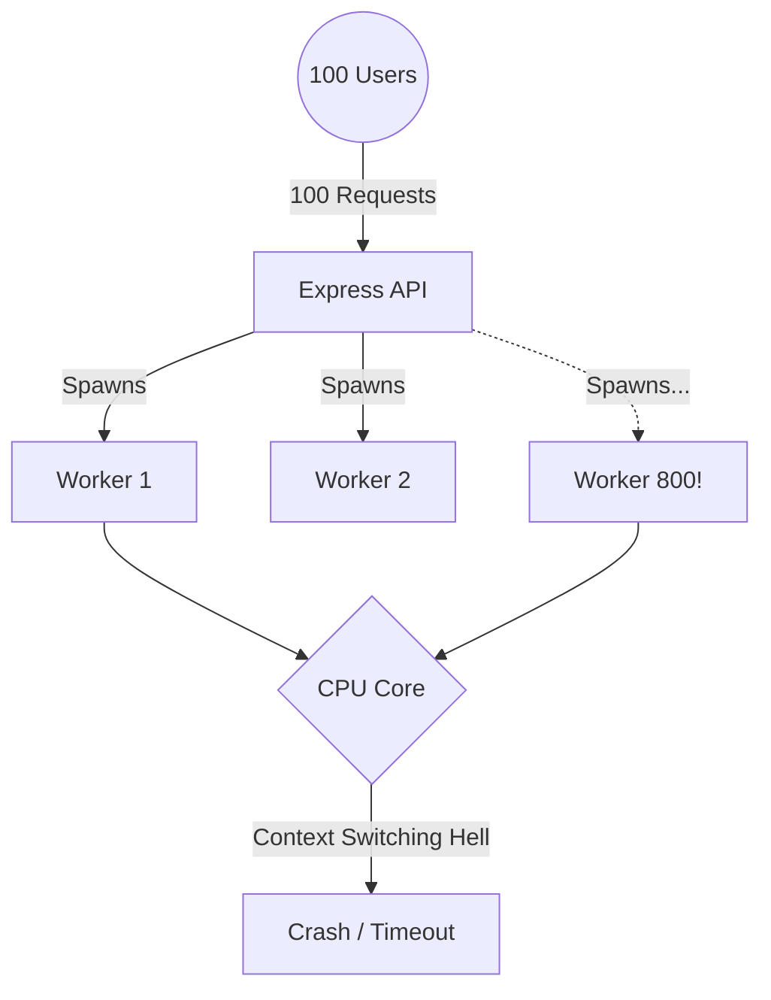
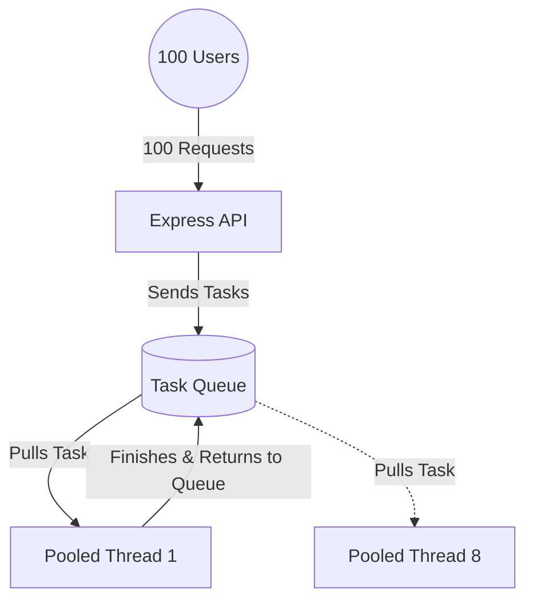
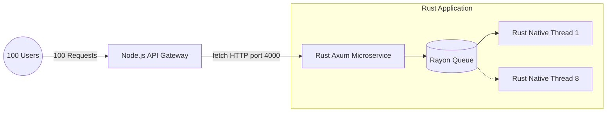
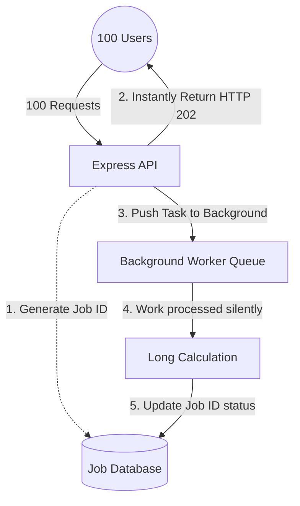

  <h1>🚀 High-Performance Node.js: Concurrency & Microservices</h1>
  
A deep dive into scaling CPU-bound tasks in Node.js. From naive thread spawning to a robust Rust-powered Microservice architecture.

---

## 📖 The "Heavy Lifter" Scenario
We have a CPU-intensive mathematical calculation: **Counting to 20 Million operations.** 
If we run this directly on the main thread, Node.js will block all other users. To solve this, we split the workload across **8 background threads**.

But how we manage those threads changes everything. Here is the journey of how we architecturalized the solution, load-tested with `autocannon` (**100 concurrent users for 10 seconds**).

---

## 🏛 Architecture 1: Unpooled Workers (The "Crash & Burn")
**Folder:** `01-unpooled-workers`

### The Concept
For every single incoming request, we spawn 8 fresh OS threads using `new Worker()`.

### 📊 Benchmark Results
| Metric | Result |
| :--- | :--- |
| **Total Requests** | `0` |
| **Timeouts / Errors** | `100` |
| **Latency** | `Timeout` |

### 🚨 Critical Understandings Uncovered
- **Thread Exhaustion:** Creating 100 requests × 8 threads = 800 OS threads instantly.
- **Context Switching Overhead:** The CPU spends more time desperately switching focus between 800 threads than actually doing the math. Operations grind to a halt.
- **The Result:** A self-inflicted Denial of Service (DoS) attack.

---

## 🏛 Architecture 2: The Traffic Cop (Thread Pool Manager)
**Folder:** `02-thread-pool`

### The Concept
Instead of wild thread spawning, we use the `piscina` library. It boots up a strictly limited **Pool of 8 Threads** and utilizes an in-memory **Task Queue**.

### 📊 Benchmark Results
| Metric | Result |
| :--- | :--- |
| **Total Requests** | `~1,050` requests |
| **Timeouts / Errors** | `0` |
| **Average Latency** | `~915ms` |
| **Throughput** | `~105 req/sec` |

### 🚨 Critical Understandings Uncovered
- **Task Queuing:** By limiting threads to match the computer's physical CPU cores (8), we maximize CPU efficiency. The other 92 requests wait beautifully in line.
- **Event Loop Protection:** The server remains stable. Zero timeouts. A true **production-ready** approach for tasks taking 10ms - 2 seconds.

---

## 🏛 Architecture 3: The Heavy Lifter (Rust Microservice API)
**Folder:** `03-microservice`

### The Concept
We completely extract the math from the Node API. Node.js acts purely as an **API Gateway**, instantly offloading the math to a standalone Microservice written in **Rust** (using `axum` for HTTP and `rayon` for native thread pooling).

### 📊 Benchmark Results
| Metric | Result |
| :--- | :--- |
| **Total Requests** | `~4,973` requests 🏆 |
| **Timeouts / Errors** | `0` |
| **Average Latency** | `~195ms` ⚡️ |
| **Throughput** | `~500 req/sec` |

### 🚨 Critical Understandings Uncovered
- **Compiled vs. Interpreted:** Rust complies down to bare-metal machine code, allowing it to calculate millions of integers at blistering speeds compared to JavaScript's V8 dynamic engine.
- **The Network Tradeoff:** Opening an internal HTTP socket to talk between Node and Rust takes a couple of milliseconds. However, Rust's raw math speed is so phenomenally fast that it completely swallows the network penalty and **still outperforms native Node.js by nearly 5x**.
- **Blast Radius Isolation:** If the Rust server hits 100% CPU usage processing video or heavy math, the primary Express.js API Gateway is totally unharmed, smoothly serving thousands of other visitors simultaneously.

---

## � Architecture 4: Asynchronous Task Queue (Event-Driven)
**Folder:** `04-async-task-queue`

### The Concept
For massive tasks taking hours (like processing video or machine learning), holding an HTTP connection open is disastrous because browsers will eventually close the connection with a "Network Timeout" error. 

Instead of waiting for the calculation to finish (synchronous), Node.js instantly generates a **Job ID**, adds the problem into a Background Task Database/Queue, and immediately returns a **202 Accepted** response. The user can poll the `/status/:jobId` endpoint later to check if it's completed.

### 📊 Benchmark Results
| Metric | Result |
| :--- | :--- |
| **Total Requests** | `~25,000+` requests 🤯 |
| **Timeouts / Errors** | `0` |
| **Average Latency** | `~2ms` ⚡️ |
| **Throughput** | `~2,500 req/sec` |

### 🚨 Critical Understandings Uncovered
- **The "Cheating" Benchmark:** The server easily hits 25,000 requests per second because Node.js *didn't actually do any math yet*. It simply generated a Job tracking ID and replied. The math is piling up silently in the background queue.
- **When it Shines:** Essential for operations taking 5 seconds to 5 hours (Video Rendering, email blasts, massive PDFs). It provides instant feedback to the user ("We are processing your video!").
- **When it Lacks:** Unnecessary overhead for fast operations (10ms - 2s) where the frontend needs to render the exact result immediately on the screen without pinging a "Status Polling API" every second to check if it's done.

---

## 🏆 Final Scoreboard (10-Second Barrage, 100 Users)

| Architecture | Setup | Stability | 10-Second Performance | Best Use Case |
| :--- | :--- | :--- | :--- | :--- |
| **1. Unpooled** | Bare-metal JS | ❌ Crashed | `0 reqs` | Literally never. |
| **2. JS Thread Pool** | JS Queue | ✅ 100% Stable | `1,050 reqs` | Medium CPU tasks (10ms - 2s). |
| **3. Rust Microservice**| Sync API Gateway | ✅ 100% Stable | `4,973 reqs` | High CPU tasks, strong segregation. |
| **4. Async Job Queue** | Event-Driven Queue | ✅ 100% Stable | `25,000+ reqs` | Massive tasks (hours long). |

 

*Built to explore and document the fascinating depths of horizontal scaling, CPU context switching, OS thread exhaustion, and low-level vs interpreted languages.*