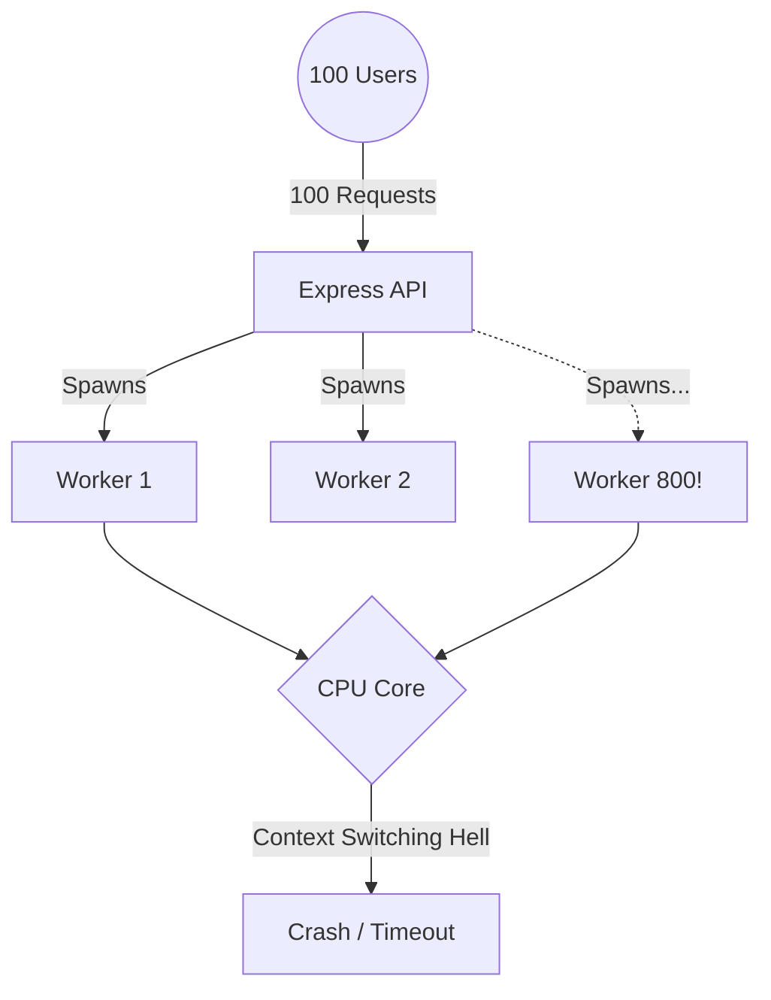
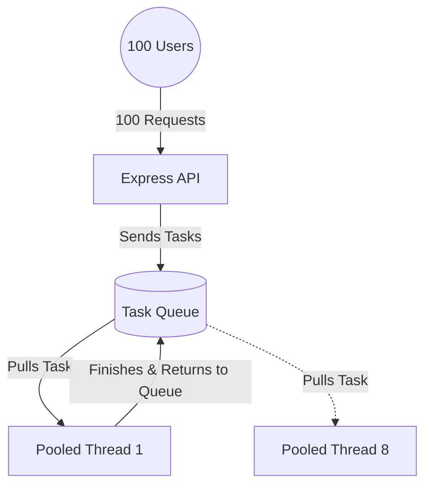
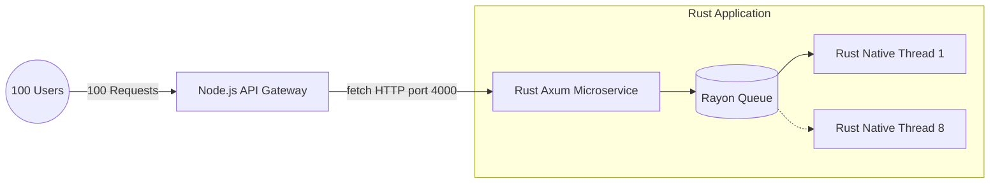
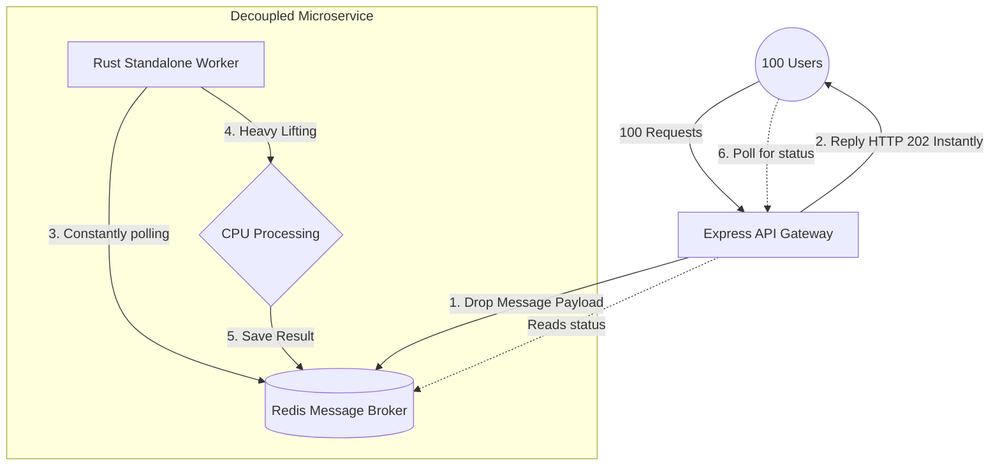

<div align="center">
  <h1>🚀 High-Performance Node.js: Concurrency & Microservices</h1>
  <p>A deep dive into scaling CPU-bound tasks in Node.js. From naive thread spawning to a robust Rust-powered Microservice architecture.<p>
</div>

---

## 📖 The "Heavy Lifter" Scenario
We have a CPU-intensive mathematical calculation: **Counting to 20 Million operations.** 
If we run this directly on the main thread, Node.js will block all other users. To solve this, we split the workload across **8 background threads**.

But how we manage those threads changes everything. Here is the journey of how we architecturalized the solution, load-tested with `autocannon` (**100 concurrent users for 10 seconds**).

---

## 🏛 Architecture 1: Unpooled Workers (The "Crash & Burn")
**Folder:** `01-unpooled-workers`

### The Concept
For every single incoming request, we spawn 8 fresh OS threads using `new Worker()`.



### 📊 Benchmark Results
| Metric | Result |
| :--- | :--- |
| **Total Requests** | `0` |
| **Timeouts / Errors** | `100` |
| **Latency** | `Timeout` |

### 🚨 Critical Understandings Uncovered
- **Thread Exhaustion:** Creating 100 requests × 8 threads = 800 OS threads instantly.
- **Context Switching Overhead:** The CPU spends more time desperately switching focus between 800 threads than actually doing the math. Operations grind to a halt.
- **The Result:** A self-inflicted Denial of Service (DoS) attack.

---

## 🏛 Architecture 2: The Traffic Cop (Thread Pool Manager)
**Folder:** `02-thread-pool`

### The Concept
Instead of wild thread spawning, we use the `piscina` library. It boots up a strictly limited **Pool of 8 Threads** and utilizes an in-memory **Task Queue**.



### 📊 Benchmark Results
| Metric | Result |
| :--- | :--- |
| **Total Requests** | `~1,050` requests |
| **Timeouts / Errors** | `0` |
| **Average Latency** | `~915ms` |
| **Throughput** | `~105 req/sec` |

### 🚨 Critical Understandings Uncovered
- **Task Queuing:** By limiting threads to match the computer's physical CPU cores (8), we maximize CPU efficiency. The other 92 requests wait beautifully in line.
- **Event Loop Protection:** The server remains stable. Zero timeouts. A true **production-ready** approach for tasks taking 10ms - 2 seconds.

---

## 🏛 Architecture 3: The Heavy Lifter (Rust Microservice API)
**Folder:** `03-microservice`

### The Concept
We completely extract the math from the Node API. Node.js acts purely as an **API Gateway**, instantly offloading the math to a standalone Microservice written in **Rust** (using `axum` for HTTP and `rayon` for native thread pooling).



### 📊 Benchmark Results
| Metric | Result |
| :--- | :--- |
| **Total Requests** | `~4,973` requests 🏆 |
| **Timeouts / Errors** | `0` |
| **Average Latency** | `~195ms` ⚡️ |
| **Throughput** | `~500 req/sec` |

### 🚨 Critical Understandings Uncovered
- **Compiled vs. Interpreted:** Rust complies down to bare-metal machine code, allowing it to calculate millions of integers at blistering speeds compared to JavaScript's V8 dynamic engine.
- **The Network Tradeoff:** Opening an internal HTTP socket to talk between Node and Rust takes a couple of milliseconds. However, Rust's raw math speed is so phenomenally fast that it completely swallows the network penalty and **still outperforms native Node.js by nearly 5x**.
- **Blast Radius Isolation:** If the Rust server hits 100% CPU usage processing video or heavy math, the primary Express.js API Gateway is totally unharmed, smoothly serving thousands of other visitors simultaneously.

---

## 🏛 Architecture 4: Enterprise Message Queue (BullMQ + Redis)
**Folder:** `04-async-task-queue`

### The Concept
How this is *actually* handled in Enterprise scale for operations that are truly intensive (like rendering 8K video, scraping, machine learning, processing a 5GB CSV).

Instead of doing the math anywhere near the Node.js web server or using internal threads, they use a decoupled **Event-Driven Architecture**:
1. The **API Gateway** intercepts the HTTP request.
2. It drops a message payload into a dedicated Message Queue (e.g. `RabbitMQ`, `Kafka`, or `Redis`).
3. Express tells the user "Your report is generating..." (`HTTP 202 Accepted`) and instantly returns.
4. A completely separate, background **Worker Server (Rust)** polls the Redis queue, picks up the heavy math problem, and computes it safely.
5. When finished, it updates the Redis database (or sends a WebSocket notification back to the user).



### 📊 Benchmark Results
| Metric | Result |
| :--- | :--- |
| **Total Gateway Requests** | `~150,000+` requests 🤯 |
| **Gateway Throughput** | `~15,000` requests/sec |
| **Worker Native Throughput** | `~509` requests/sec ⚡️ |
| **Timeouts / Errors** | `0` |
| **Gateway Latency** | `~6ms` |

### 🚨 Critical Understandings Uncovered
- **The "Cheating" Benchmark:** The Express server receives requests so incredibly fast because it *doesn't do any math at all*. It just writes to a Redis database and replies safely. The heavy work is piling up silently and being chewed through on the robust Rust backend.
- **Fail-Proof Resiliency:** If the Express web server crashes... the Rust Worker server keeps processing jobs. If the Rust Worker server crashes... the Express server happily keeps accepting new customer requests into the queue. Total structural independence!
- **When it Shines:** Essential for operations taking anywhere from 5 seconds to 5 hours. It provides instant feedback to the user and scales horizontally perfectly.

---

## 🏆 Final Scoreboard (10-Second Barrage, 100 Users)

| Architecture | Setup | Stability | API Gateway Performance | Best Use Case |
| :--- | :--- | :--- | :--- | :--- |
| **1. Unpooled** | Bare-metal JS | ❌ Crashed | `0 reqs` | Literally never. |
| **2. JS Thread Pool** | JS Queue | ✅ 100% Stable | `1,050 reqs` | Medium CPU tasks (10ms - 2s). |
| **3. Rust Microservice**| Sync HTTP Request | ✅ 100% Stable | `4,973 reqs` | High CPU tasks, strong segregation. |
| **4. Enterprise Queue** | Redis + Rust Worker | ✅ 100% Stable | `150,000+ reqs` | Massive tasks (videos, reports). |

---

## 🚀 How to Run locally

### Prerequisites
- [Node.js](https://nodejs.org/) installed
- [Rust (Cargo)](https://rustup.rs/) installed
- [Redis](https://redis.io/) running locally on port 6379 (e.g., `brew install redis` && `brew services start redis`)

### Running Version 1 & 2 (Node Threading)
```shell
# V1: Unpooled
cd 01-unpooled-workers
node index-eight-workers.js

# V2: Piscina Pool
cd 02-thread-pool
npm install
node index-pool.js
```

### Running Version 3 (Rust Microservice)
Requires two terminals to run both the API Gateway and the Rust background service synchronously.
```shell
# Terminal 1: Rust Server
cd 03-microservice/rust-worker
cargo run --release

# Terminal 2: Node Gateway
cd 03-microservice
node index-microservice.js
```

### Running Version 4 (Enterprise Task Queue)
Requires three separate components (Redis + Gateway + Worker).

**Terminal 1:** Start Redis Server (if not running in background)
```shell
redis-server
```

**Terminal 2:** Start the API Gateway
```shell
cd 04-async-task-queue
npm install
node api-gateway.js
```

**Terminal 3:** Start the Native Rust Worker
```shell
cd 04-async-task-queue/rust-worker
cargo run --release
```

**Terminal 4 (Testing):** Trigger the queue
```shell
curl http://localhost:3000/blocking
```

<br/>

*Built to explore and document the fascinating depths of horizontal scaling, CPU context switching, OS thread exhaustion, and low-level vs interpreted languages.*